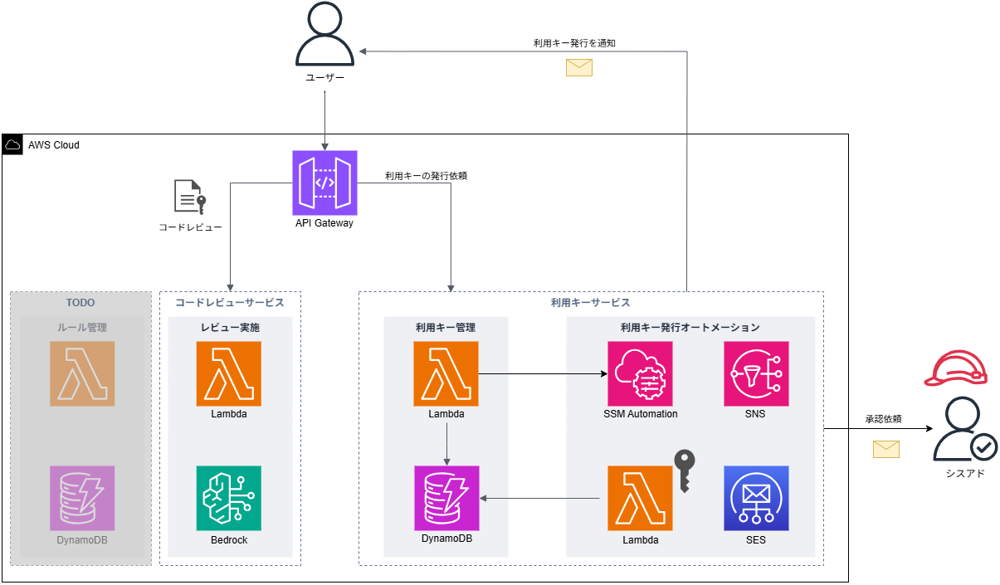

# LLM Code Reviewer

## 概要

**LLM Code Reviewer**は、大規模言語モデル(LLM)を利用した簡易的なコードレビューAPIを提供します。 
ユーザーはソースコードを送信し、事前に定義された**コーディングルール**に基づいてフィードバックを受け取ることができます。

## 開発経緯
新入社員教育(新人教育)用のコーディング学習アプリのサービスの一部として開発しています。 
新人教育では新人が実装したソースコードの問題を検出するために静的解析ツールを導入していますが、以下のような品質に関わる全ての側面をカバーできるわけではないと考えています。
* 変数名や関数名が処理内容を適切に表しているかといった、役割や意味が伝わる命名規則になっているか。
* コードの重複が避けられており、共通のロジックは再利用可能な関数やモジュールに抽出されているか。
* コメントが不足していたり、逆に冗長であったりしないか。
* etc...

これらの課題を解決し、新人がより深い理解を得られるようにするという目的で開発に至っています。

## 要件定義
* 静的解析でカバーできないようなコードの問題（例：命名の適切性、コメントの質）を検出できるようにする。
* 自然言語によるフィードバックを通じて、ユーザーが問題の本質をより深く理解し、改善に導くことができるようにする。
* 学習者のレベルに合わせてレビューの観点の追加・削除・編集できるようにする。
* コードレビューはWebAPIとしてサービス提供し、クライアントアプリケーションに依存しないようにする。
* コードレビューは利用キーを必須とし、利用キーのない要求は拒否できるようにする。
* コードレビューはサービス制限を設け、1日あたりの実行回数に制限をかけることができるようにする。

## アーキテクチャ

## 使用技術
### バックエンドアプリケーション
* Python
  * boto3
* Docker

### インフラストラクチャ
* Amazon Web Service (AWS)
  *   Amazon Bedrock
  *   API Gateway
  *   DynamoDB
  *   Lambda
  *   System Manager Parameter Store
  *   Simple Notification Service (SNS)
  *   Simple Email Service (SES)

## ドキュメント

|分類|ドキュメント名|備考|
|----|--------------|----|
|マニュアル|[deployment.md](docs/manual/deployment.md)|デプロイ手順に関する資料|
|マニュアル|[prerequisites.md](docs/manual/prerequisites.md)|デプロイ前に必要な事前手順をまとめた資料|
|マニュアル|[configuring_coding_rules.md](docs/design/configuring_coding_rules.md)|コーディングルールの設定方法に関する資料|
|API仕様書|[api_specification.md](docs/spec/api_specification.md)||
|設計書|[architecture.md](docs/design/architecture.md)|アーキテクチャ概要資料|
