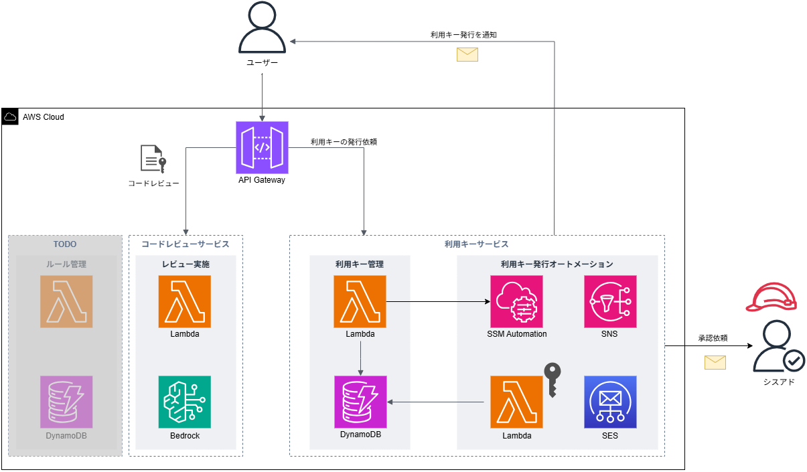

# アーキテクチャ概要

## 全体像

LLM Code Reviewerは、AWSのサーバーレスアーキテクチャを基盤として構築されています。API Gatewayでリクエストを受け付け、Lambda関数でビジネスロジックを実行し、DynamoDBでデータを永続化します。LLMとの連携にはAmazon Bedrockを利用します。

## 主要コンポーネント

*   **API Gateway**: クライアントからのリクエストを受け付けるAPIのエンドポイントです。利用キーによる認証と流量制御も担当します。
*   **Lambda**: ビジネスロジックを実行するコアコンポーネントです。「利用キー発行」と「コードレビュー」の2つの主要な機能を提供します。
*   **DynamoDB**: 利用キーの情報を格納するNoSQLデータベースです。
*   **Amazon Bedrock**: 大規模言語モデル(LLM)を呼び出し、コードレビュー結果を生成します。
*   **System Manager (Parameter Store)**: BedrockのモデルIDやAPIキーのUsage Plan IDなど、アプリケーションの設定情報を安全に管理します。
*   **SES (Simple Email Service)**: 利用キーの発行時などに、ユーザーへの通知メールを送信します。
*   **SSM (Systems Manager) Automation**: 利用キー発行時の承認ワークフローを実行します。

## ワークフロー

### 利用キー発行

### コードレビュー実施

