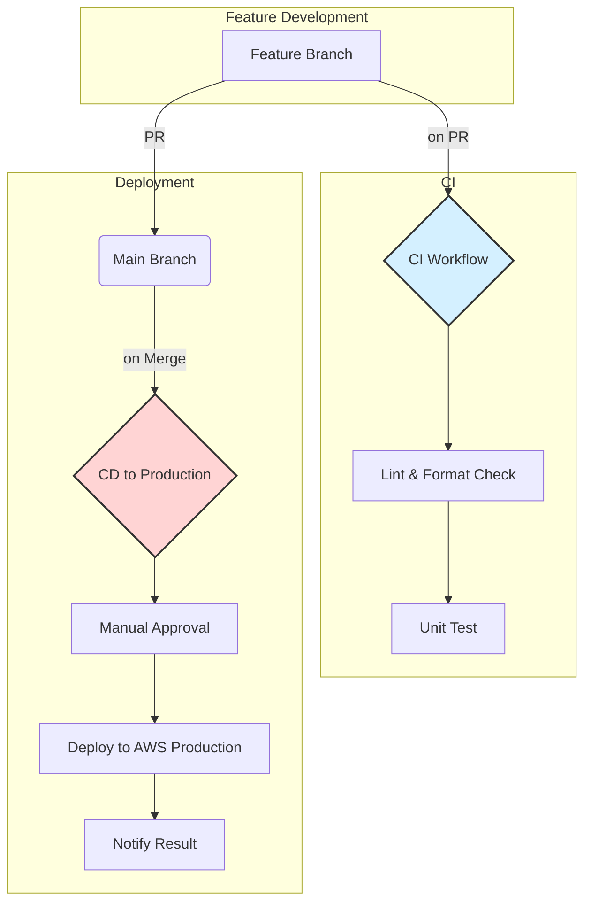

# CI/CD 設計書

## 1. はじめに
本ドキュメントは、CI/CD（継続的インテグレーション/継続的デプロイメント）の設計について記載する。

### 1.1. 目的
CI/CDパイプラインを導入することにより、以下の目的を達成します。

- **品質向上**: コードのマージ前に静的解析と単体テストを自動実行し、コードの品質を担保します。
- **デプロイの自動化と高速化**: 手動によるデプロイ作業をなくし、迅速かつ安全にアプリケーションを各環境へリリースします。
- **開発生産性の向上**: ビルド、テスト、デプロイのプロセスを自動化することで、開発者が本来の開発作業に集中できる環境を構築します。

### 1.2. 利用サービス
GitHubが提供するCI/CDサービスである**GitHub Actions**を利用する。

## 2. ワークフロー管理方針

GitHub ActionsではCI/CDパイプラインのワークフローをYAML形式で定義しリポジトリ内で管理します（以降、**ワークフローファイル**と記載）。

本章では**ワークフローファイル**の管理方針について記載する。

### 2.1. ワークフローファイル格納先
本リポジトリでは原則 **.github/workflows直下** にワークフローファイルを格納することを禁止とします。  
**.github/workflows**直下に下記テーブルで示すディレクトリを用意しているので適宜格納してください。

|フォルダ名|説明|
|------------|------|
|ci/| build/lint/testなどCIに関連するワークフローを格納する|
|deploy/| デプロイに関連するワークフローを格納する|

### 2.2. ファイル命名規則
ワークフローファイルはファイル名から内容が読み取れるように命名します。

（例）**ci-myapp-python.yaml**、**deploy-staging.yaml**

## 3. CI/CD 全体フロー
本リポジトリにおけるCI/CDパイプラインを以下に示す。

## 4. CI (継続的インテグレーション) 設計

TBD

## 5. CD (継続的デプロイメント) 設計

TBD

