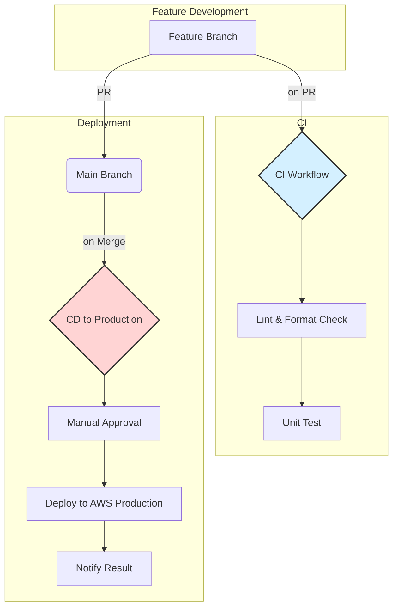

# CI/CD 設計書

## 1. はじめに
本ドキュメントは、CI/CD（継続的インテグレーション/継続的デプロイメント）の設計について記載する。

### 1.1. 目的
CI/CDパイプラインを導入することにより、以下の目的を達成します。

- **品質向上**: コードのマージ前に静的解析と単体テストを自動実行し、コードの品質を担保します。
- **デプロイの自動化と高速化**: 手動によるデプロイ作業をなくし、迅速かつ安全にアプリケーションを各環境へリリースします。
- **開発生産性の向上**: ビルド、テスト、デプロイのプロセスを自動化することで、開発者が本来の開発作業に集中できる環境を構築します。

### 1.2. 利用サービス
GitHubが提供するCI/CDサービスである**GitHub Actions**を利用する。

## 2. ワークフロー管理方針

GitHub ActionsではCI/CDパイプラインのワークフローをYAML形式で定義しリポジトリ内で管理します（以降、**ワークフローファイル**と記載）。

本章では**ワークフローファイル**の管理方針について記載する。

### 2.1. ワークフローファイル格納先
本リポジトリでは原則 **.github/workflows直下** にワークフローファイルを格納することを禁止とします。  
**.github/workflows**直下に下記テーブルで示すディレクトリを用意しているので適宜格納してください。

|フォルダ名|説明|
|------------|------|
|ci/| build/lint/testなどCIに関連するワークフローを格納する|
|deploy/| デプロイに関連するワークフローを格納する|

### 2.2. ファイル命名規則
ワークフローファイルはファイル名から内容が読み取れるように命名します。

（例）**ci-myapp-python.yaml**、**deploy-staging.yaml**

## 3. CI/CD 全体フロー
本リポジトリにおけるCI/CDパイプラインを以下に示す。

---

## 3. CI (継続的インテグレーション) 設計

`feature/*` ブランチから `develop` ブランチへのPull Request作成・更新をトリガーとして、CIパイプラインを実行します。これにより、マージ前にコードの品質を検証します。

- **ワークフローファイル**: `.github/workflows/ci.yml`
- **トリガー**: `on: pull_request: branches: [ develop ]`

### 3.1. ジョブとステップ

| ジョブ名 | ステップ                                                               | 説明                                                                    |
| -------- | ---------------------------------------------------------------------- | ----------------------------------------------------------------------- |
| `build-and-test` | 1. **Checkout Code** (`actions/checkout`)                               | リポジトリのソースコードをチェックアウトします。                          |
| | 2. **Set up Python** (`actions/setup-python`)                             | 指定されたバージョンのPython環境をセットアップします。                    |
| | 3. **Install Dependencies** (`pip install -r requirements.txt`)          | `requirements.txt` に基づいてPythonの依存ライブラリをインストールします。 |
| | 4. **Lint & Format Check** (`flake8`, `black --check`)                    | `flake8`によるコーディング規約チェックと`black`によるフォーマットチェックを実行します。 |
| | 5. **Unit Testing** (`pytest`)                                          | `pytest` を使用して単体テストを実行し、コードの正当性を検証します。         |

---

## 4. CD (継続的デプロイメント) 設計

### 4.1. 開発環境 (Staging) へのデプロイ

`develop` ブランチへのマージをトリガーとして、開発環境への自動デプロイを実行します。

- **ワークフローファイル**: `.github/workflows/cd-staging.yml`
- **トリガー**: `on: push: branches: [ develop ]`

| ジョブ名 | ステップ                                                               | 説明                                                                                                     |
| -------- | ---------------------------------------------------------------------- | -------------------------------------------------------------------------------------------------------- |
| `deploy-to-staging` | 1. **Checkout Code**                                                  | ソースコードをチェックアウトします。                                                                       |
| | 2. **Configure AWS Credentials** (`aws-actions/configure-aws-credentials`) | OIDCを利用して、AWSへのアクセス権限を持つ一時的なクレデンシャルを取得します。                              |
| | 3. **Deploy to AWS**                                                      | AWS SAMやServerless Framework等を使い、Lambda関数やAPI GatewayなどのAWSリソースをデプロイします。 |
| | 4. **Send Notification**                                                | デプロイ結果（成功/失敗）をSlackなどのチャットツールに通知します。                                         |

### 4.2. 本番環境 (Production) へのデプロイ

`main` ブランチへのマージをトリガーとして、本番環境へのデプロイを実行します。安全性を高めるため、手動承認ステップを設けます。

- **ワークフローファイル**: `.github/workflows/cd-production.yml`
- **トリガー**: `on: push: branches: [ main ]`

| ジョブ名 | ステップ                                                               | 説明                                                                                                     |
| -------- | ---------------------------------------------------------------------- | -------------------------------------------------------------------------------------------------------- |
| `deploy-to-production` | 1. **Manual Approval** (`environment`の保護ルール)                      | GitHub Actionsの`environment`機能を利用し、承認者によるデプロイ承認を必須とします。                      |
| | 2. **Checkout Code**                                                  | ソースコードをチェックアウトします。                                                                       |
| | 3. **Configure AWS Credentials**                                      | OIDCを利用して、本番環境用のAWSロールの一時的なクレデンシャルを取得します。                              |
| | 4. **Deploy to AWS**                                                      | 本番環境向けの設定値を使用して、AWSリソースをデプロイします。                                              |
| | 5. **Send Notification**                                                | デプロイ結果をSlackなどのチャットツールに通知します。                                                      |

---

## 5. 利用するGitHub Actions / Secrets

### 5.1. 主なGitHub Actions

- `actions/checkout@v4`: ソースコードのチェックアウト
- `actions/setup-python@v5`: Python環境のセットアップ
- `aws-actions/configure-aws-credentials@v4`: AWS認証情報の設定 (OIDC利用)

### 5.2. 必要なSecrets / Variables

GitHubリポジトリの `Settings > Secrets and variables > Actions` に以下の情報を設定します。

| 種別       | 名前                    | 説明                                                                     | 設定スコープ         |
| ---------- | ----------------------- | ------------------------------------------------------------------------ | -------------------- |
| Secret     | `STAGING_AWS_ROLE_ARN`  | 開発環境へデプロイするためのIAMロールのARN (OIDC用)。                    | `staging` environment |
| Secret     | `PRODUCTION_AWS_ROLE_ARN` | 本番環境へデプロイするためのIAMロールのARN (OIDC用)。                      | `production` environment |
| Secret     | `SLACK_WEBHOOK_URL`     | 通知用のSlack Incoming Webhook URL。                                       | Repository           |
| Variable   | `AWS_REGION`            | デプロイ対象のAWSリージョン (例: `ap-northeast-1`)。                      | Repository           |

---

## 6. その他

### 6.1. セキュリティ考慮事項

- **OIDCの利用**: AWSのアクセスキーをGitHub Secretsに直接保存するのではなく、OpenID Connect (OIDC) を利用して一時的な認証情報を取得します。これにより、認証情報の漏洩リスクを大幅に低減します。
- **最小権限の原則**: OIDCで利用するIAMロールには、各環境へのデプロイに必要な最小限の権限のみを付与します。
- **ブランチ保護ルール**: `main`および`develop`ブランチにはブランチ保護ルールを設定し、直接のプッシュを禁止し、Pull Request経由でのマージを必須とします。また、CIのチェックが成功しないとマージできないように設定します。

### 6.2. 今後の課題

- E2E (End-to-End) テストの導入と自動化
- パフォーマンステスト、負荷テストの自動化
- ドキュメント (API仕様書など) の自動生成とサイトへのデプロイ